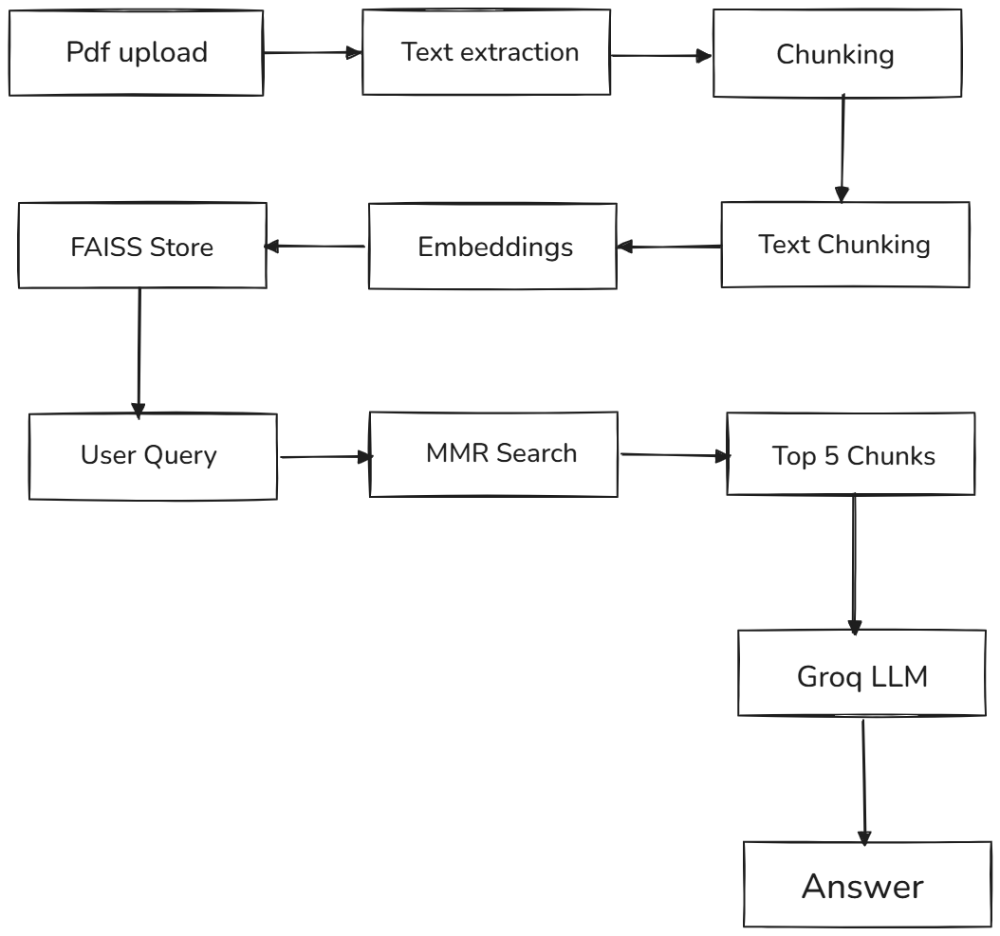

# 📚 AI Powered Smart Study Assistant

> An intelligent study assistant that allows you to upload PDFs and ask questions, generate quizzes, and get summaries powered by RAG pipeline and Groq LLM.


---

## 🎯 What This Project Does

Upload any PDF study material and:
- 💬 Ask questions in natural language
- 📝 Generate structured summaries
- 🎯 Auto generate MCQ quizzes
- 🧠 Remembers conversation context
- 📑 Support multiple PDFs at once
- 🔍 Source citations with every answer

---

## 🏗️ Architecture

---

## 🛠️ Tech Stack

| Component | Technology |
|-----------|-----------|
| **LLM** | Groq API — Llama 3.3 70B |
| **RAG Framework** | LangChain |
| **Vector Database** | FAISS |
| **Embeddings** | Sentence Transformers (all-MiniLM-L6-v2) |
| **PDF Processing** | PyPDF |
| **UI** | Streamlit |
| **Language** | Python 3.11 |

---

## ✨ Features

- **RAG Pipeline** — Retrieval Augmented Generation for accurate answers
- **MMR Search** — Maximum Marginal Relevance for diverse chunk retrieval
- **Conversation Memory** — Remembers last 5 exchanges for follow up questions
- **Source Citations** — Every answer shows which source it came from
- **Multi PDF Support** — Upload and query multiple PDFs simultaneously
- **Quiz Generator** — Auto generates 5 MCQs from uploaded content
- **Summarization** — Generates structured summaries with key concepts
- **Error Handling** — Graceful handling of bad PDFs and API failures
- **Logging** — Complete activity logging for debugging

---

## 📁 Project Structure
---

## 🚀 Getting Started

### Prerequisites
- Python 3.11+
- Groq API key — free at console.groq.com

### Installation

**1. Clone the repository**
```bash
git clone https://github.com/Ashwitharapolu/AI-Study-Assistant.git
cd AI-Study-Assistant
```

**2. Create virtual environment**
```bash
python -m venv venv
venv\Scripts\activate
```

**3. Install dependencies**
```bash
pip install -r requirements.txt
```

**4. Set up API key**

Create a `.env` file and add:
**5. Run the app**
```bash
streamlit run app.py
```

**6. Open browser at**
---

## 💡 How to Use

1. Upload your PDF study material in the sidebar
2. Click **Process PDFs** and wait 2-3 minutes
3. Ask any question in the chat box
4. Click **Summarize PDF** for a structured summary
5. Click **Generate Quiz** for 5 auto generated MCQs

---

## 📊 How RAG Works

```
Step 1 — User uploads PDF
Step 2 — PDF text extracted using PyPDF
Step 3 — Text split into 500 char chunks with 50 char overlap
Step 4 — Each chunk converted to 384 dimension vector
Step 5 — Vectors stored in FAISS index
Step 6 — User asks a question
Step 7 — Question converted to vector
Step 8 — MMR search finds top 5 relevant diverse chunks
Step 9 — Chunks + question sent to Groq LLM
Step 10 — LLM generates answer with source citation
```
## 🔑 Environment Variables

| Variable | Description |
|----------|-------------|
| `GROQ_API_KEY` | Your Groq API key from console.groq.com |

---

## 📊 Resume Highlights

- Built RAG pipeline using LangChain + FAISS enabling semantic Q&A over uploaded PDFs
- Implemented MMR retrieval combining relevance and diversity for better answer quality
- Added conversation memory storing last 5 exchanges for contextual follow up questions
- Built multi PDF support with combined FAISS indexing across documents
- Implemented quiz generation and summarization using prompt engineering with Groq LLM

---

## 👤 Author

**Ashwitha Rapolu**
- GitHub: [@Ashwitharapolu](https://github.com/Ashwitharapolu)

---

*Built with using RAG + LangChain + FAISS + Groq*